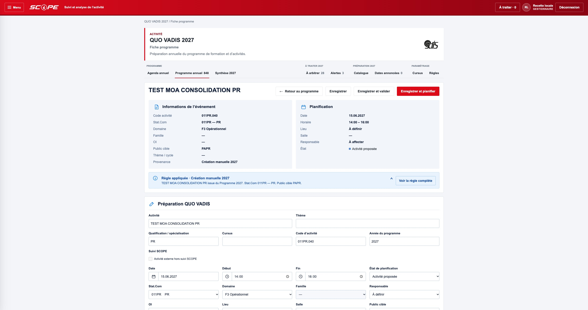
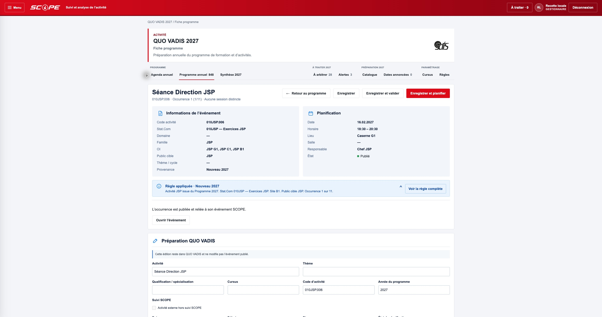
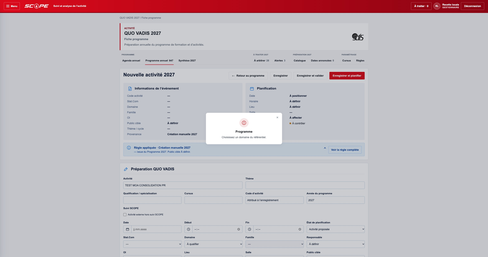
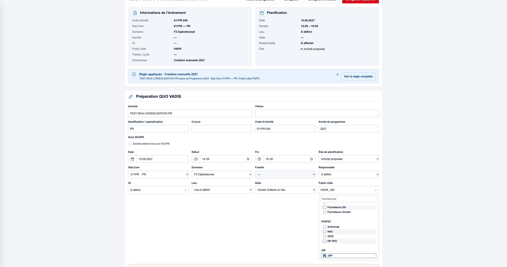

# QUO VADIS 2027 - Consolidation finale MOA

## Etat repris

- Main GitHub controle : `51ffd32438306729614eb638ce972a8fe625e891`.
- Branche initiale : `codex/qv-2027-operational-release-20261008`, HEAD `aab211dd75e59676c80ee33709634d13658edeaa` ; arbre identique a main.
- Corrections de creation reprises non commitees : fiche, API, service PostgreSQL, code metier et validation de l'annee.
- Travaux locaux hors lot conserves : serveur de recette preexistant, PDF temporaires, sorties et scripts de preuve non suivis.

## Corrections livrees

La creation reutilise la fiche Programme et `updateProgrammePreparation`. Les preparations manuelles sont presentees avec les occurrences canoniques dans Programme et Agenda. Le compteur de code existant est utilise par Stat.Com, sans creation d'evenement operationnel.

| Action explicite | Workflow | Planification |
| --- | --- | --- |
| Enregistrer | Conserve | Conserve |
| Enregistrer et valider | Valide | Conserve |
| Enregistrer et planifier | Valide | Planifiee, date et horaires requis |

Les trois actions reviennent au Programme en conservant recherche, filtres, mode et contexte. Une erreur conserve le formulaire et reactive les actions. Les evenements publies et leur filiation restent independants de l'edition preparatoire.

Les fiches creees et transformees utilisent les memes panneaux, champs et actions. Les informations canoniques de qualification/cursus restent en lecture seule sur les occurrences transformees. Les listes de public/OI restent dans le flux de page, avec deplacement visible du menu ouvert, defilement interne et espace sous le formulaire.

## Reference ORION

Depot directement lu : `Sdisnv/DLCreatorWeb`, HEAD local `dfe59842780e46c3c65dddc5becb649de1e666ee`.

- `js/services/feedback/orion-feedback-ui-v1.js` : `showSuccess`, icones de `iconSvg`, fermeture et priorite des surfaces bloquantes.
- `css/orion-feedback-ui-v1.css` : surface centree `orion-fb-success-layer` / `orion-fb-success-center`, dimensions, couleurs et typographie.

Conformement a la decision MOA, cette surface centree est appliquee aux quatre types dans le mecanisme partage `ScopeFeedback.notify`. Succes : 2500 ms ; information/avertissement : 5000 ms ; erreur : fermeture explicite. Croix et touche Echap disponibles, roles status/alert et aria-live adaptes. Les confirmations critiques et leur action bloquante restent prioritaires. Les notifications sont exterieures au formulaire ; leur fermeture ne reconstruit pas les champs.

## Recette et tests

Clone exclusivement : PostgreSQL local `scope_qv_2027_recipe_20261006`, port 5432. Aucune connexion ou ecriture de production. Aucun `generateProgramme` global appele.

| Controle | Resultat |
| --- | --- |
| Test clone de creation et des trois actions | PASS, baseline 847, code `011PR.040`, aucun autre preparation modifiee, aucun evenement cree, ROLLBACK verifie |
| `scope-qv-programme-fiche-calendar-moa-tests.js` | 18/18 PASS |
| `scope-qv-moa-final-consolidation-tests.js` | 4/4 PASS |
| `scope-qv-operational-exports-tests.js` | 8/8 PASS |
| `scope-login-visual-alignment-orion-1-tests.js` | 6/6 PASS ; anciennes listes figees de cles de cache remplacees par verification des assets versionnes, authentification inchangee |
| `scope-ux-orion-alignment-arch-1-tests.js` | 8/8 PASS |
| `npm run check` | PASS |
| `git diff --check` | PASS |

Chrome reel, URL de recette `http://127.0.0.1:4406/scope.html#/quo-vadis/programme` :

- Erreur sur domaine manquant : meme fiche, intitule conserve, notification centrale.
- Creation PR/PAPR sans OI : 847 -> 848, etat propose, `011PR.040`.
- Validation : workflow Valide, planification toujours proposee.
- Planification : workflow Valide et planification Planifiee.
- Modification de l'intitule et de la date au 16.06.2027 : etats et code conserves.
- Retour au Programme : recherche `TEST MOA`, filtre F3 et resultat unique conserves pour les trois actions.
- Agenda : occurrence modifiee presente le 16 juin ; 848 seances representees et datees pendant la transaction.
- Dernier choix JSP du public cible accessible et selectionnable ; selection temporaire annulee avant sauvegarde.
- Variante compacte choisie dans l'interface : apercu PDF une page, nom correct, seule la ligne filtree exportee.
- Fiche publiee Direction JSP consultee sans ecriture : identite et lien evenement visibles.
- Fermeture du serveur : `ROLLBACK PASS`, retour du clone a son etat initial.

## Captures

## PDF de demonstration

Livres localement dans `output/pdf/qv-moa-final-20261009/`, sans inclusion des fichiers temporaires dans le commit.

| Fichier | Seances | Pages | Format |
| --- | --- | --- | --- |
| `SCOPE_QUO_VADIS_2027_Planning_annuel.pdf` | 847 | 40 | A4 paysage, presentation detaillee existante |
| `SCOPE_QUO_VADIS_2027_Liste_compacte.pdf` | 10 | 1 | A4 paysage, recherche Codir, dont deux seances avec repas |
| `SCOPE_QUO_VADIS_2027-04_Planning_mensuel.pdf` | 52 | 4 | A4 portrait, avril |

Rendu visuel controle : colonnes lisibles, aucun debordement, panneaux calendaires conserves en detaille/mensuel et absents en compact. Le compact reste chronologique et respecte exactement les lignes filtrees. Les noms suivent dynamiquement l'annee et le mois.

## Limite de livraison

Candidat de PR uniquement. Aucun merge, deploiement, migration ou changement de production. Les 847 seances existantes restent preservees. Validation MOA requise avant mise en production.
